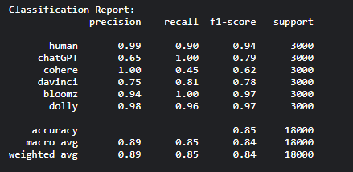
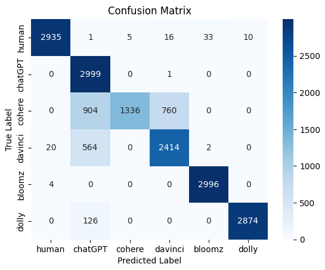

# Model Used for this Multi-class classification:
## Best model: roberta-large
* After testing multiple baseline models, roberta-large seemed to outperform all of them.
* Acheived a validation accuracy of 99.55% and a testing accuracy of 85.12%.
* Used a Custom Weighted Cross Entropy Loss function to fix class imbalance.
* Hyper-Parameters used:
	1) Epochs: 5
	2) Learning Rate: 2e-5
	3) Batch Size: 16
* Tracking all metrics using Weights and Biases Tool - found to be very useful to check if peft and quantization techniques are working on small-language models.
* Performance on test data: 
	
* Confusion Matrix: 
	
