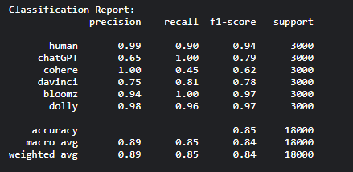
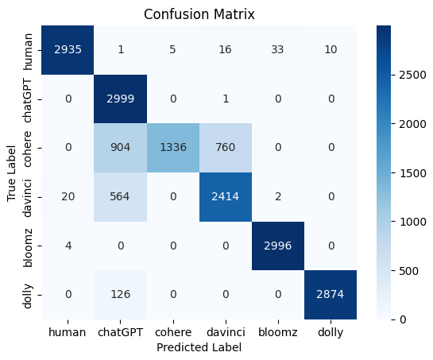

# Model Used for Multi-Class Classification

## Best Model: RoBERTa-large

After extensive testing with multiple baseline models, **RoBERTa-large** emerged as the top performer, delivering impressive results.

### Key Achievements

- **Validation Accuracy**: 99.55%
- **Testing Accuracy**: 85.12%
- **Class Imbalance**: Addressed using a custom Weighted Cross Entropy Loss function.

### Hyperparameters

- **Epochs**: 5
- **Learning Rate**: 2e-5
- **Batch Size**: 16

### Model Tracking

We leveraged the **Weights and Biases** tool to track all key metrics, which proved invaluable in evaluating the effectiveness of parameter-efficient fine-tuning (PEFT) and quantization techniques on smaller language models.

### Performance on Test Data

### Confusion Matrix

### Highlights

- **Error Analysis**: 
  - **Cohere vs. ChatGPT**: These models often produce outputs with similar sentence and grammatical structures, making their distinction challenging.
  - **ChatGPT vs. Davinci**: Both are OpenAI models with ChatGPT being a refined version of Davinci. Their responses share similarities due to their common lineage.

---

RoBERTa-large showcased its prowess in handling this complex multi-class classification task, setting a high benchmark for performance.
